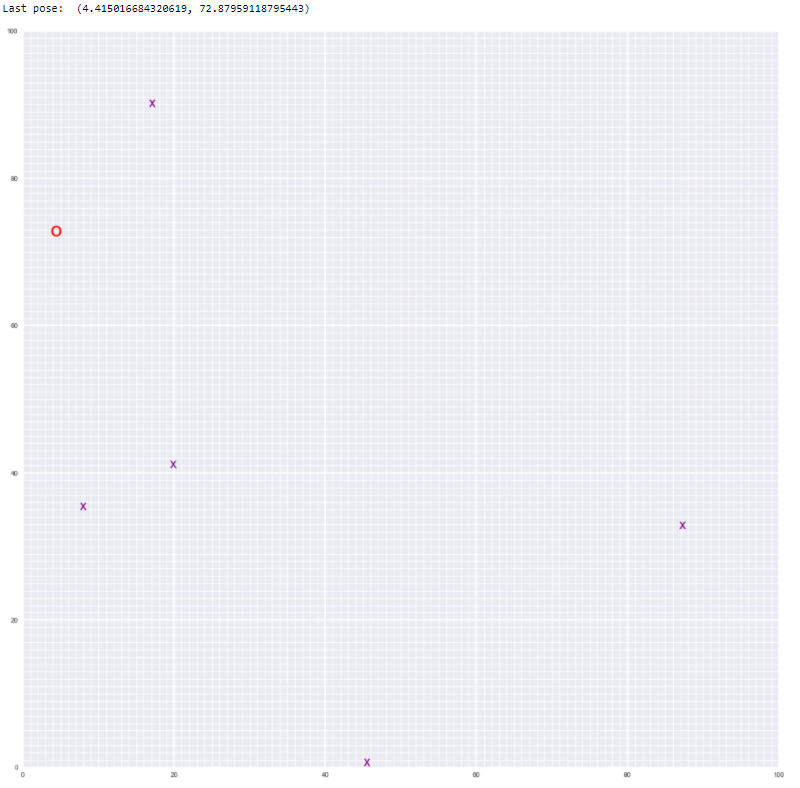
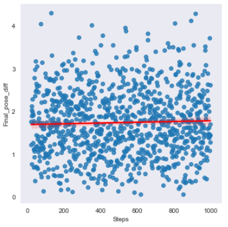
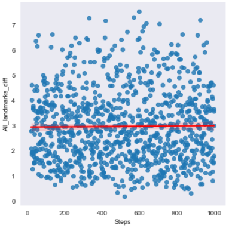

# Landmark Detection & Robot Tracking (SLAM)

## Project Overview

This project is all about implementation SLAM (Simultaneous Localization and Mapping) for a 2 dimensional world. Goal is to combine what we know about robot sensor measurements and movement to create a map of an environment from only sensor and motion data gathered by a robot, over time. SLAM gives us a way to track the location of a robot in the world in real-time and identify the locations of landmarks such as buildings, trees, rocks, and other world features. This is an active area of research in the fields of robotics and autonomous systems. 

*Below is an example of a 2D robot world with landmarks (purple x's) and the robot (a red 'o') located and found using *only* sensor and motion data collected by that robot. This is just one example for a 50x50 grid world; in your work you will likely generate a variety of these maps.*

<p align="center">
  
</p>

The project will be broken up into three Python notebooks; the first two are for exploration of provided code, and a review of SLAM architectures, **only Notebook 3 and the `robot_class.py` file will be graded**:

__Notebook 1__ : Robot Moving and Sensing

__Notebook 2__ : Omega and Xi, Constraints 

__Notebook 3__ : Landmark Detection and Tracking 

__robot_class.py__ : Robot class with its world parameters

__helpers.py__ : helper functions for making data, world display

## Local Environment Instructions

1. Clone the repository, and navigate to the downloaded folder.
```
git clone https://github.com/Antanskas/SLAM.git
```

2. Create (and activate) a new environment, named `cv-nd` with Python 3.6. If prompted to proceed with the install `(Proceed [y]/n)` type y.

	- __Linux__ or __Mac__: 
	```
	conda create -n cv-nd python=3.6
	source activate cv-nd
	```
	- __Windows__: 
	```
	conda create --name cv-nd python=3.6
	activate cv-nd
	```

6. Install a few required pip packages, which are specified in the requirements text file (including OpenCV).
```
pip install -r requirements.txt
```
To implement Graph SLAM, a matrix and a vector (omega and xi, respectively) are introduced. The matrix is square and labelled with all the robot poses (xi) and all the landmarks (Li).

## Graph SLAM

Every time we make an observation, for example as we move between two poses by some distance dx and can relate those two positions, you can represent this as a numerical relationship in these matrices.

We are referring to robot poses as Px, Py and landmark positions as Lx, Ly, and one way to approach this challenge is to add both x and y locations in the constraint matrices.

<p align="center">
  
</p>

## Grid world

<p align="center">
  
</p>

This is a map our robot moves in and landmarks it estimates.
Given ground true robot poses (coordinates after each move) and ground true coordinates of the landmarks on a map
we can compare how our robot estimates its own poses and landmark coordinates using SLAM.

Final estimated pose: (4.415016684320619, 72.87959118795443)<br>
True final pose: (3.35286, 71.62254)<br>

Estimated landmarks:<br>
(8.019, 35.446)<br>
(19.882, 41.192)<br>
(45.504, 0.673)<br>
(17.149, 90.208)<br>
(87.297, 32.854)<br>

True landmarks:<br>
(9, 36)<br>
(21, 41)<br>
(47, 1)<br>
(18, 91)<br>
(88, 33)<br>

## Errors over N - steps taken
From the test took in Notebook 3 we can also see that errors between true and estimated poses as well as landmarsk positions do not really change:

<p align="center">
  
</p>
<p align="center">
  
</p>

LICENSE: This project is licensed under the terms of the MIT license.
